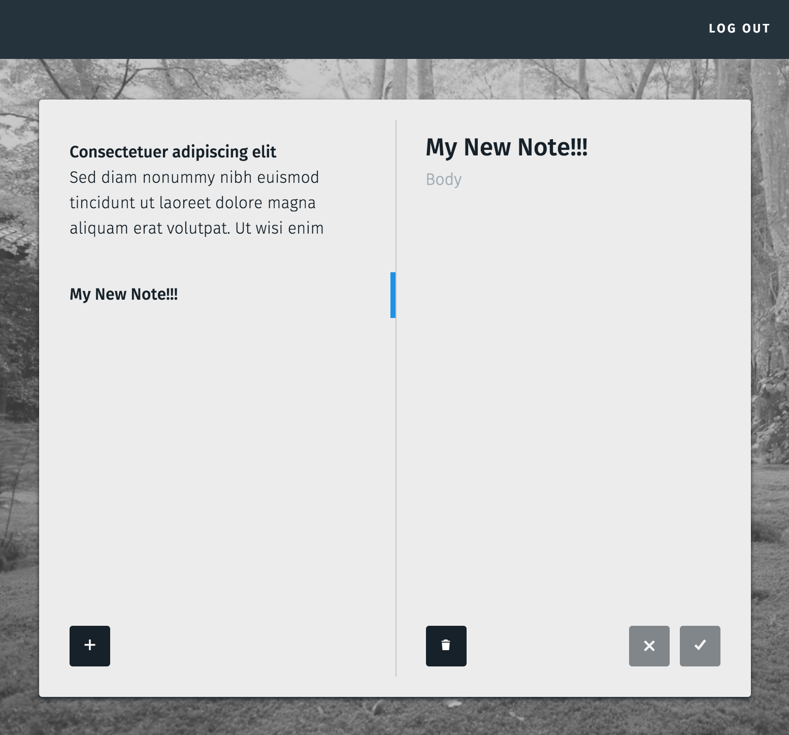

Notecards
===


Setup
---
```
# Switch to the correct node version
nvm use

# Build css/js
npm start

# Run app
rlwrap lein figwheel dev devcards

# Visit http://localhost:8888
```

Questions
---
- figwheel: Does figwheel support historyApiFallback?
- om: Is there a way to notify the action creator of the result of an action? For example, if signup succeeds, I want to redirect to the login page.
- om: How do I set React children? [This doesn't work.](https://github.com/omcljs/om/issues/291)
- sablono: How can I do `(if pred vector)` with sablono?

TODO
---
- Prevent multiple signups if one is in progress. Same for many other requests.
- Focus login password field after signup.
